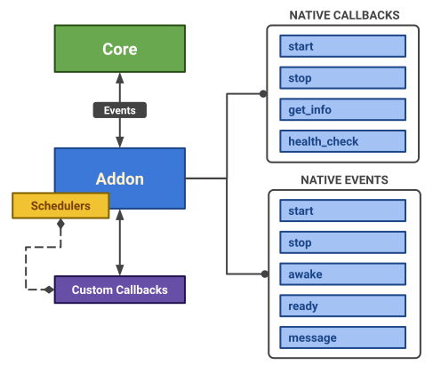

# Create your first SlimIO Addon

## For who ?
This guide has been designed for Node.js/Javascript developers.

> We assumes that you have already installed and set up a local agent. If not, please refer to this [link](https://github.com/SlimIO/Governance/blob/master/docs/get_started.md#slimio-starter-guide)

## Requirements

- [Node.js](https://nodejs.org/en/) version 10 or higher.
- [Git](https://git-scm.com/) (**for manual installation**).
- [SlimIO CLI](https://github.com/SlimIO/CLI#cli)

> ⚠️ Node.js must be installed first to get access to npm.

To setup the SlimIO CLI with **npm** just run in your terminal:
```bash
$ npm install @slimio/cli -g
```

> Dont hesitate to check the [CLI guide](https://github.com/SlimIO/Governance/blob/master/docs/use_cli.md#use-cli)

## Getting Started

Go to the root of your Agent folder and run the SlimIO `create` command:
```bash
$ cd yourAgentFolder
$ slimio create addon --name addonName
```

The generated code will be the following (where `addonName` is the name of the addon you specified):
```js
const Addon = require("@slimio/addon"); 

const addonName = new Addon("addonName"); 

addonName.on("start", async() => {
    // Tell the core that your addon is ready !
    await addonName.ready();
});

module.exports = addonName;
```

A complete API Documentation of Addon can be found [here](https://github.com/SlimIO/Addon#addon).

<p align="center">

</p>

By default an Addon already chip with some **Callbacks** and **Events**.

## Register and schedule a callback

There is two ways to register a callback:

>The callback should be an Asynchronous Function (Synchronous function will be rejected with a TypeError).

```js
myAddon.registerCallback("callback_name", async function() {
    console.log("callbackName has been executed!");
});
```
>Please, be sure to avoid Anonymous function as much possible!
Or by passing the callback reference as the name (The function can't be anonymous, else it will throw an Error).

```js
async function callback_name() {
    console.log("callbackName has been executed!");
}
myAddon.registerCallback(callback_name);
```
>Callback name should be writted by following the snake_case convention snake_case !

Schedule a callback execution interval. Use the package @slimio/scheduler to achieve a scheduler !

```js
const Scheduler = require("@slimio/scheduler");
const Addon = require("@slimio/addon");

const myAddon = new Addon("myAddon");

myAddon.registerCallback(async function sayHelloEveryOneSecond() {
    console.log("hello world");
});
myAddon.schedule("sayHelloEveryOneSecond", new Scheduler({ interval: 1 }));
```

## Addon Events states ( start, stop, awake, ready, message )
Addon is extended with a SlimIO Safe EventEmitter. Five kinds of events can be triggered:

| event | description |
| --- | --- |
| start | When the core ask the addon to start |
| stop | When the core ask the addon to stop |
| awake | When the addon is ready to awake (all locks are ok) |
| ready | When the developer trigger ready() method to tell the Core that the addon is Ready for events
| message | When the developer want to Send a lazy message to a given target formatted as following: addon.callback, the returned value is an Observable (package zen-observable).

>Message event
<details><summary>sendMessage< T >(target: string, options?: MessageOptions): ZenObservable.ObservableLike< T ></summary>
<br />

>Send a lazy message to a given target formatted as following: `addon.callback`. The returned value is an Observable (package **zen-observable**).
```js
const myAddon = new Addon("myAddon");

myAddon.on("start", function() {
    myAddon
        .sendMessage("cpu.get_info")
        .subscribe(console.log);
    myAddon.ready();
});
```
>For Message Event , this are the Available options:

| name | default value | description |
| --- | --- | --- |
| args | Empty Array | Callback arguments |
| noReturn | false | If `true`, the method will return void 0 instead of a new Observable |
| timeout | 5000 | Timeout delay (before the hook expire) |
</details>
</details>

<details><summary>sendOne< T >(target: string, options?: MessageOptions | any[]): Promise< T ></summary>
<br />

>you can send one lazy message to a given target. The returned value is a Promise (Use sendMessage under the hood).

```js
const myAddon = new Addon("myAddon");

myAddon.on("start", async function() {
    const addons = await myAddon.sendOne("gate.list_addons");
    console.log(addons);

    myAddon.ready();
});
```

Available options are the same as **sendMessage()**. If options is an Array, the message options will be constructed as follow
```
{ args: [] }
```
</details>