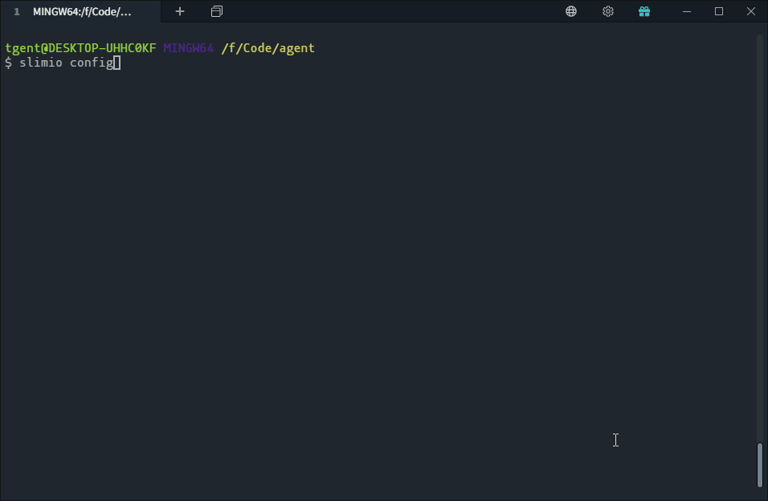

# SlimIO Starter Guide

## Summary

The purpose of this guide is to allow Developers and Integrators to initialize and setup a SlimIO Agent on the local machine (The next guide will be dedicated to how to create your first addon).

## Requirements

- [Node.js](https://nodejs.org/en/) version 10 or higher.
- [Git](https://git-scm.com/) (**for manual installation**).
- [SlimIO CLI](https://github.com/SlimIO/CLI)

> ⚠️ Node.js must be installed first to get the **npm** binary command.

To setup the SlimIO CLI with **npm** just run in your terminal:
```bash
$ npm install @slimio/cli -g
```

Then, run the `--help` or `-h` command to known the complete list of available commands.
```
$ slimio --help
 
  Usage
    $ slimio <command> [options]

  Available Commands
    init       Clone and install a complete SlimIO Agent
    add        Add one or many addon(s) to the local agent (Addon are enabled by default).
    remove     Remove one or many addons from the local agent (Erase them from the disk)
    create     Create/generate SlimIO files and addons
    build      Build and compile an agent into an executable with Node.js bundled in it
    archive    Create an addon archive
    connect    Connect to a local or remote running agent
    config     Configure a local agent or a remote running agent
    debug      debug (navigate through local agent dump files)
    start      start the local agent and enable/unlock advanced debug tools
    set        Setup a new settings in the local cache
    get        Get one or all keys stored in the local cache (return all keys if no argument is given).  

  For more info, run any command with the `--help` flag
    $ slimio init --help
    $ slimio add --help

  Options
    -v, --version    Displays current version
    -h, --help       Displays this message
```

> 👀 If you'r working with private SlimIO packages, think to setup [tokens](https://github.com/SlimIO/Governance/blob/master/docs/tooling.md#environment-variables).

## Manual installation

> ⚠️ Manual installation require a lot of experience as a Node.js developer.

For anyone who want to known how to setup an Agent without the help of the CLI.. follow the [Getting Started](https://github.com/SlimIO/Agent#getting-started) on the Agent repository.

This repository describe how work an **Agent** and list **all his components** (useful if you want to dig deeper).

## Getting Started
To setup a basic agent just run the following command at the location where you want the agent to be installed:

```bash
$ slimio init
```

> ⚠️ The init command create the folder for you (dont mkdir an agent directory yourself).

The CLI will then install the **complete agent** in "agent" folder by default (which include five **built-in** addon).

<p align="center">

</p>

The command can be customised to choose the directory name and eventually initialize with additionals addons (for example to install **ihm**, **prism** etc..). Addons must be separated by **comma**.

```bash
$ slimio init dirName --add ihm,prism
```

---

Now that your agent is installed you can launch it with
```bash
$ cd agent # enter in the installed directory (if not done yet).
$ slimio start
# OR without npm
$ node index --autoreload 500
```

> 👀 Complete documentation on the script argument [here](https://github.com/SlimIO/Agent#cli-options)

## Install / Add one or many addons

<p align="center">

</p>

If you want to install additional addons, just go to the root of the agent and run following command:

```bash
$ cd yourAgentFolder
$ slimio add cpu-addon
# Or use the complete github URL
$ slimio add https://github.com/SlimIO/cpu-addon
```

By default all addon(s) are writted as active in **agent.json**.
```json
{
    "addons": {
        "cpu": {
            "active": true,
            "standalone": false
        }
    }
}
```

> 👀 📄 for more information on agent.json fields, check [Agent configuration](https://github.com/SlimIO/Agent#agent-configuration)

If you want to add each addons as `active: false` add the `-d` (--disabled) option.

```bash
$ slimio add cpu-addon -d 
```

<p align="center">

</p>

## Remove installed addon
It is possible to completely remove **installed** addon with the `slimio remove` command. Let's imagine that we want to remove the ihm addon. Just run the following command in your terminal:

```bash
$ slimio remove ihm
```

<p align="center">

</p>

By default the addon will be deleted from the local **agent** configuration. (agent.json). If for some reason the addon has been removed from **./addons** but not from **agent.json**, then just run a synchronization:

```bash
$ slimio config sync
```

## Configure agent.json
The SlimIO CLI expose a `config` command that allow you to easily manage and edit **agent.json**. By default this command run a [REPL](https://en.wikipedia.org/wiki/Read%E2%80%93eval%E2%80%93print_loop) (Real-eval-print-loop) if there is no arguments provided (Like the example bellow).

<p align="center">

</p>

Running `help` into this REPL will give you the complete list of available commands.

These commands can be runned without entering the REPL mode, few examples:
```bash
$ slimio config sync
$ slimio config enable ihm,cpu
```

Notice that addons must be separated by a comma for `sync`, `enable` and `disable` commands.
