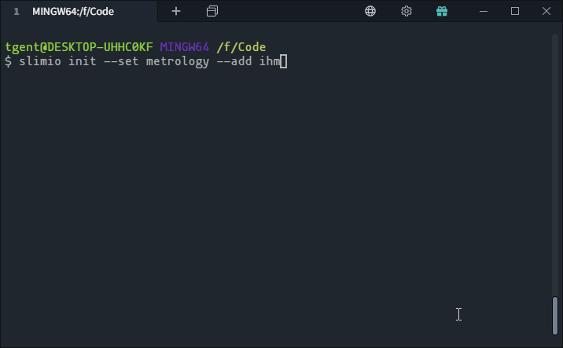
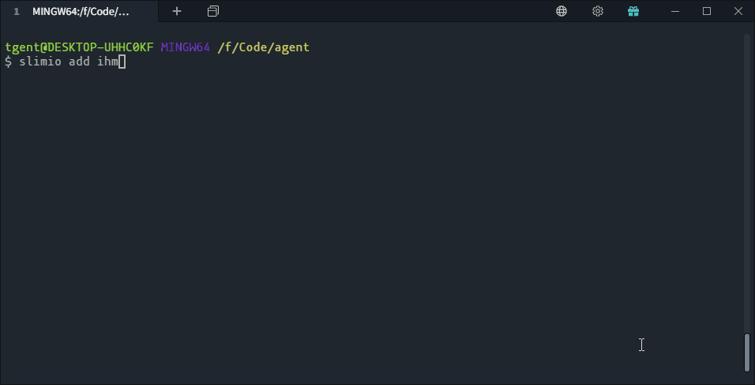

# SlimIO Starter Guide

## Description

The purpose of this guide is to allow Node.js / Javascript developers to initialize the slimio agent locally at first, then we will see in the next how to add slimio addons.

If you already know how to install a local slimio agent, please refer to this [link](https://github.com/SlimIO/Governance/blob/master/docs/first_addon.md#create-your-first-slimio-addon) for the rest of the guide

## Requirements

- [Node.js](https://nodejs.org/en/) version 10 or higher.
- [Git](https://git-scm.com/) (**for manual installation**).
- [SlimIO CLI](https://github.com/SlimIO/CLI)

> ⚠️ Node.js must be installed first to get access to npm.

To setup the SlimIO CLI with **npm** just run in your terminal:
```bash
$ npm install @slimio/cli -g
```

And then run the **help** command
```
$ slimio --help

  Usage
    $ slimio <command> [options]

  Available Commands
    init       Initialize a new SlimIO Agent
    add        Add an addon to the agent
    create     Create bunch of files for the agent
    build      Build the agent
    connect    Build the agent

  For more info, run any command with the `--help` flag
    $ slimio init --help
    $ slimio add --help

  Options
    -v, --version    Displays current version
    -h, --help       Displays this message
```


## Manual installation
For anyone who want to known how to setup an Agent without the help of the CLI.. follow the [Getting Started](https://github.com/SlimIO/Agent#getting-started) on the Agent repository.

This repository describe how work an **Agent** and list **all his components** (must be useful if you want to dig deeper).

## Getting Started
To setup a basic agent just run the following command at the location where you want the agent to be installed:

```bash
$ cd directoryWhereYouWantToInstall
$ slimio init
```

The CLI will then install the **complete agent** in "agent" folder by default (which include five **built-in** addon).

<p align="center">

</p>

The command can be customised to choose the directory name and eventually initialize with additionals addons (for example to install **ihm**, **prism** etc..). Addons must be separated by **comma**.

```bash
$ slimio init dirName --add ihm,prism
```

---

Now that your agent is installed you can launch it with
```bash
$ npm start
```
Remember that to launch the agent, you must be at the root of it.

## Add addon

<p align="center">

</p>

If you want to install additional addons, just go to the root of the agent and run following command:

```bash
$ cd yourAgentFolder
$ slimio add cpu-addon
# Or use the github URL
$ slimio add https://github.com/SlimIO/cpu-addon
```

By default all addon(s) are writted as active in **agent.json**.
```json
{
    "addons": {
        "cpu": {
            "active": true, // <-- active by default
            "standalone": false
        }
    }
}
```

> Note: for more information on agent.json fields, check [Agent configuration](https://github.com/SlimIO/Agent#agent-configuration)

If you want to add a disabled addon by default, use the -d option.

```bash
$ slimio add -d cpu-addon
```

<p align="center">

</p>

TBC
