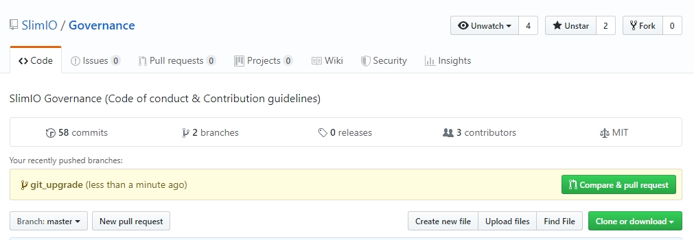
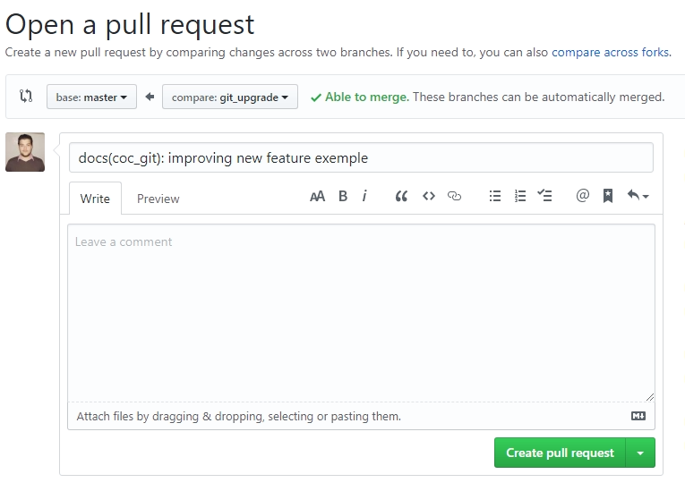
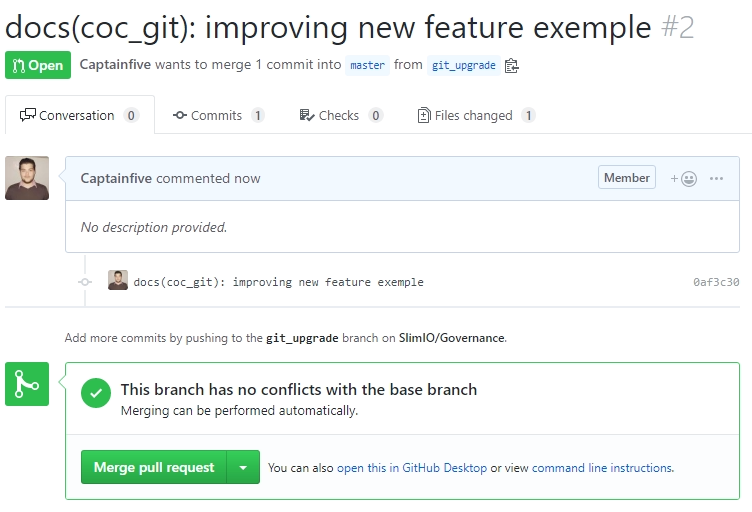

# Best practices and tips for using git in a team.

## 1. Adding a new feature on a Slimio project.

To be able to allow the people who maintain the slimio project to work correctly, it is imperative that each master branch of each project is free, nobody must be working on it, for that you need to create a branch other than master on the project in question, do your job, then merge your branch with the master, this will avoid conflicts in case of project review..

So at first, you must be sure that the project is up to date.

```bash
$ git pull
```

>With the Git version management system, it is possible to create branches locally. But integrating it into the remote repository is not enough for all commands to work afterwards. The branch must be traceable so that the commands git push or git pull work.

`Since version 1.7.0, Git provides the necessary commands to easily manage branches. A branch is created with the git checkout command by specifying the -b option and then the branch name:`

````bash
$ git checkout -b ma_branche_de_developpement
````

>To integrate the branch to the remote repository, use the git push command. The -u option tells git to create all the information needed to make the branch traceable. You must then specify the name of the remote repository (by default, it is named origin) and the name of the branch.

````bash
$ git push -u repository_distant ma_branche_de_developpement
````

`The git push and git pull commands can then work with this branch from any computer connected to the repository.`

>You can now create your feature, when finished, you can push your work on the branch, you just have to merge your branch with the master branch.

## Merging a branch into master

>Go to the project github page, you should see the "Compare and pull request" button, click on it :

<p align="left">

</p>

`You can edit the message or add a description before confirming.`

>⚠️ Make sure you compare your branch with the master.

<p align="left">

</p>

>The "pull request" is created, if it does not create any conflicts with the master branch you can fuss it by pressing the "Merge pull request" button.

<p align="left">

</p>
