# list of recurring problems (with solution) encountered with the use of git.

## Requirements
- [Git](https://git-scm.com/) (**for manual installation**).

## Summary
1. Can't push because someone else pushed before me [link](#1.-can't-push-because-someone-else-pushed-before-me)
2. How to remove the latest commits? [link](#2.-how-to-remove-the-latest-commits-?)
3. How to change my latest commit? [link](#3.-how-to-change-my-latest-commit-?)
4. I forget to add a file to my commit, how to add it simply !? [link](#4.-I-forget-to-add-a-file-to-my-commit-how-to-add-it-simply-!?)

# 1. Can't push because someone else pushed before me

>⚠️ This example assumes that you have added and commit your changes and find yourself blocking when pushing your commits to a remote folder.

`There are two situations if the merger of the "git pull" is a problem or not (imagine someone pushing a new file just before you, there is no merging conflict, but if there is one person that changes a file you have modified, this can create a conflict).`

## Case one, no merging conflict..
<p align="left">
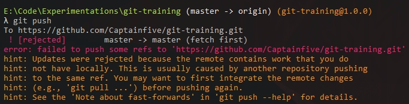
</p>

>In this case you need to put this command on your terminal :
````bash
$ git pull
````

Then you can **push** your work :D

> If you want to go back after a git pull you can execute this command :
```bash
$ git reset --keep HEAD@{1}
```
`⚠️ *Versions of git older than 1.7.1 do not have --keep. If you use such version, you could use --hard - but that is a dangerous operation because it loses any local changes.*`

## Case two, merging conflict..
<p align="left">
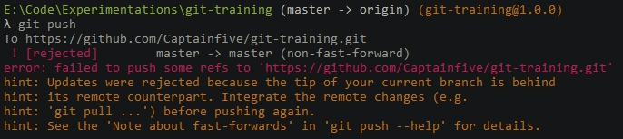
</p>

>In this case you need to put this command on your terminal :
````bash
$ git pull
````

`git will merge all the elements that do not conflict with others then it will open your text editor by proposing the differences between the two files that are in conflict.`

<p align="left">
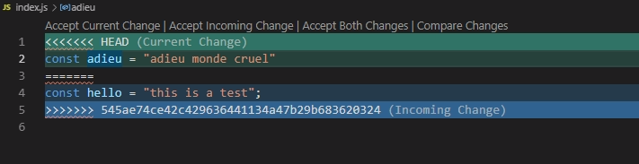
</p>

>if you accept the current change, git will keep only what you add (the green part in this case), conversely for incoming changes.

**[Summary](#summary)**
# 2. How to remove the latest commits ?

## On `local` remote
## 1. With RESET
>I just made three commits, two of which were not needed and I would like to go back

<p align="left">
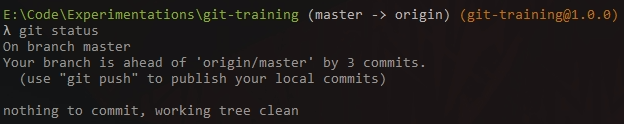
</p>

I will make this command to delete the last two commits without erasing my local work :

```bash
$ git reset HEAD~2
```
<p align="left">
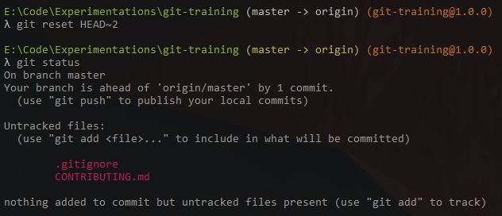
</p>

`in this case the git "reset" command moves the current branch backward by two commits, removing the two snapshots from the project history. Remember that this kind of reset should only be used on "unpublished commits".`

>⚠️ If you also want to `delete` the local changes of these commits, simply add `--hard` as option to the command :

```bash
$ git reset --hard HEAD~2
```
<p align="left">
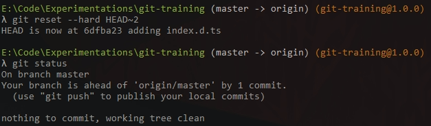
</p>

>You can now **push** your work :D

## 2. With REBASE
You can also use the `rebase` command to *delete* or *change* the history of your commits in a local folder, in this case we will just learn to delete a commit, for the changes follow this [guide]().

<p align="left">
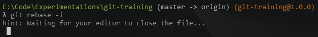
</p>

`This will open your text editor`

<p align="left">
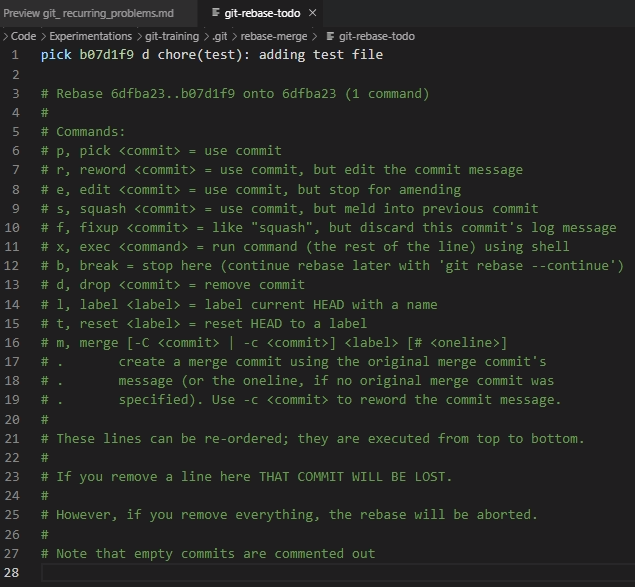
</p>

>Replace the "pick" order with "drop" to delete the commit you want.

<p align="left">

</p>

>Save the changes to the file on your text editor and close the page, the rebase will finish in your terminal.

<p align="left">
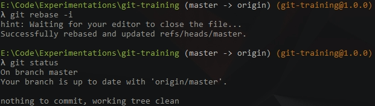
</p>

## On `public` remote

If you want to `revert` the last commit just do git revert command, then you can push this new commit, which undid your previous commit.

```bash
$ git revert commit <hash>
```

>Git will create a new commit with the inverse of the last commit. This adds a new commit to the current branch history, this is the ideal 'undo' method for working with public shared repositories.

**[Summary](#summary)**
# 3. How to change my latest commit?

I made a mistake in the message of my last commit and I do not have pushed it yet, I can use the following command to open the text editor to modify the message.

```bash
$ git commit --amend
```

<p align="left">
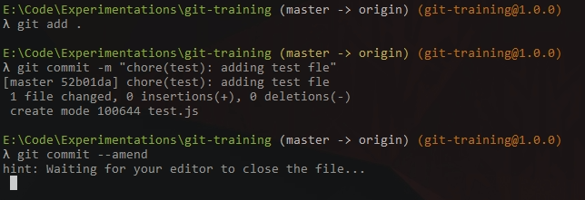
</p>


>I just need to edit the message and save it and then close the file.

<p align="left">
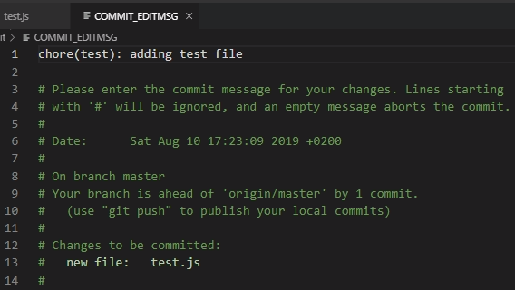
</p>


`The operation is done correctly, you have only a push if you have finished your work.`

<p align="left">
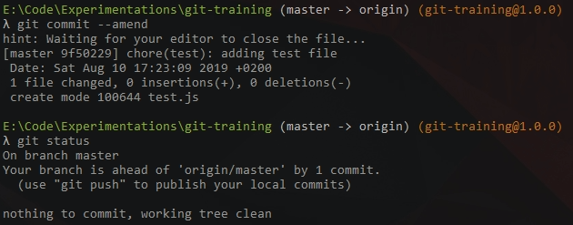
</p>

**[Summary](#summary)**
# 4. I forget to add a file to my commit how to add it simply !?


In this case I created two files in my local folder and I forget to add the second before commit, I will be able to use the following command to implement my file without erasing my commit and start again a useless manipulation.

```bash
$ git commit --amend --no-edit
```
<p align="left">
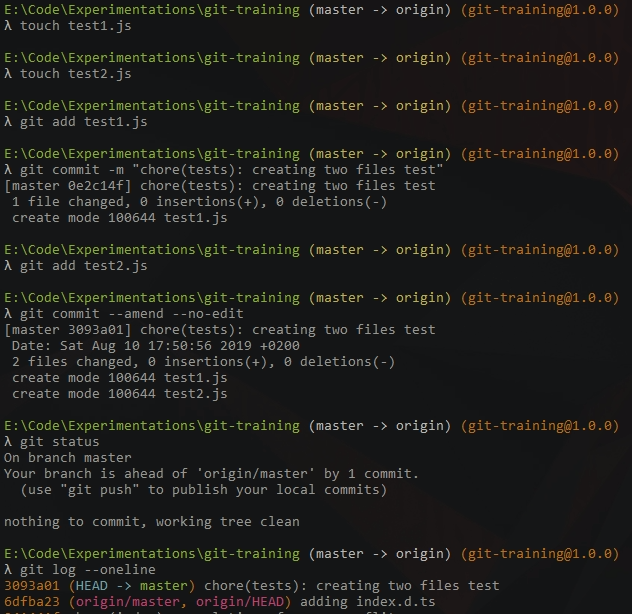
</p>
