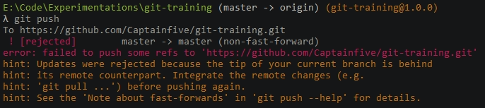

# list of recurring problems (with solution) encountered with the use of git.

## Requirements
- [Git](https://git-scm.com/) (**for manual installation**).

# 1. Can't push because someone else pushed before me

This example assumes that you have added and commit your changes and find yourself blocking when pushing your commits to a remote folder.

>There are two situations if the merger of the "git pull" is a problem or not (imagine someone pushing a new file just before you, there is no merging conflict, but if there is one person that changes a file you have modified, this can create a conflict).

## Case one, no merging conflict..
<p align="left">

</p>

In this case you need to put this command on your terminal :
````js
git pull
````

>Then you can **push** your work :D

## Case two, merging conflict..
<p align="left">

</p>

In this case you need to put this command on your terminal :
````js
git pull
````

>git will merge all the elements that do not conflict with others then it will open your text editor by proposing the differences between the two files that are in conflict.

<p align="left">

</p>

>if you accept the current change, git will keep only what you add (the green part in this case), conversely for incoming changes.

## If you want to go back just after a git pull you can execute this command.
```js
git reset --keep HEAD@{1}
```
`⚠️ *Versions of git older than 1.7.1 do not have --keep. If you use such version, you could use --hard - but that is a dangerous operation because it loses any local changes.*`