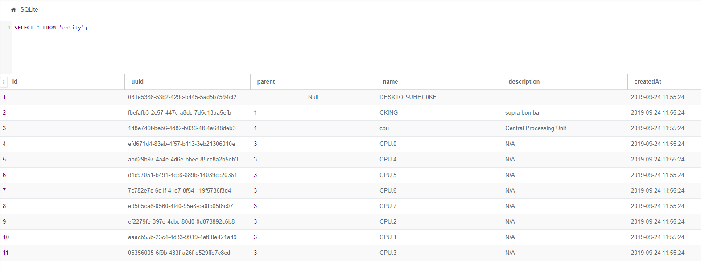

# Manage alarms and metrics

## For who ?
This guide has been designed for those who want to develop their own addons and

- Throw their own (custom) alarms.
- Declare and publish metrics.
- Declare (define) alerting rules and views.

## Requirements

- A SlimIO Agent

## Entity
SlimIO Entity is inspired and similar to [Configuration Item (CI)](https://en.wikipedia.org/wiki/Configuration_item). An entity represents a unique entity of the system where the agent live:

- Hardware component (CPU, Network Interfaces)
- Software
- Abstract (Agent, Virtual Container, etc..);
- Networks
- ...

> 👀 Each entity have their own [UUID](https://fr.wikipedia.org/wiki/Universal_Unique_Identifier) to be able to identify them during a possible centralization.

There is some important things to known:

- An entity has a **single parent** (only the root entity which describe **the agent itself has no parent**).
- A entity can be **described** with a description and many descriptors (Descriptors are dictionnary of key/value).

<p align="center">Example of Entities declaration in CPU Addon</p>

```js
const os = require("os");

const CPU_MAIN_ENTITY = new Entity("cpu", {
    description: "Central Processing Unit"
});

const cpus = os.cpus();
for (let id = 0; id < cpus.length; id++) {
    const CPU_CHILD_ENTITY = new Entity(`CPU.${id}`, { parent: CPU_MAIN_ENTITY });

    // Add descriptors (cpu speed and cpu model)
    CPU_CHILD_ENTITY
        .set("speed", cpus[id].speed)
        .set("model", cpus[id].model);
}
```

<p align="center">

</p>

Alarms and Metrics require one entity to exist. If you do not specify the entity this mean that we will use the root Agent entity (**id 1**).

## Alarm
Alarms in SlimIO are managed and stored by the [Events](https://github.com/SlimIO/Events) built-in addon (in the db/events.db file). Events expose many callbacks and the complete list allow a complete CRUD management !
Some of these callbacks are:

- create_alarm
- get_alarms
- get_alarms_occurence
- remove_alarm

But those callbacks can be painful to work with because of the Asynchronous nature of the product. That why we introduce [@slimio/alert](https://github.com/SlimIO/Alert) package that has been
build to simplify and improve the developer experience.

<p align="center">Throwing an alarm on the root entity</p>

```js
const Addon = require("@slimio/addon");
const alert = require("@slimio/alert");

const test = new Addon("test");
const { Alarm } = alert(test);

new Alarm("test alarm!", {
   correlateKey: "test_alarm"
});
```

An alarm is composed of a **severity**, **correlateKey** and one **entity**.
The **correlate key** is used to identify and increment the occurence count of a given alarm (because you can have five same alarms but for five different devices).

The correlate key (or **CK** when abbreviated) must respect the following RegEx `^[a-z_]{1,35}$` (only lowercase and underscore).
