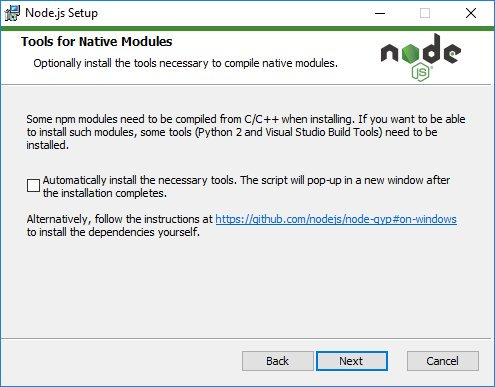

# How to contribute to N-API Addons

## Requirements
- [Node.js](https://nodejs.org/en/) v10 or higher (for N-API v3+)

## How to build a N-API addon
Follow the [installation](https://github.com/nodejs/node-gyp#installation) instructions on the node-gyp package.

For **Windows**, Node.js allow you to install build tools at installation (be sure to get the checkbox).
<p align="center">

</p>

---
When everything is setup, just run in order:
```bash
$ npx node-gyp configure
$ npx node-gyp build
```

The configure command will setup the default project configuration and download requiring Node.js headers (if they are missing). Only re-run this command if **you are updating** `binding.gyp` file.

The build command run the compiler chain.

## Available N-API npm scripts
All projects commands are described here (all N-API projects must has these commands):

| command | description |
| --- | --- |
| npm run prebuilds | Generate N-API prebuilds |
| npm run build | Run node-gyp configure and build |

## Download or update N-API headers
To download and/or update N-API headers we created our [own binary tool](https://github.com/fraxken/napi-headers).

```bash
$ napihead --help
# or
$ npx napi-headers --help
```

N-API headers must be installed at the root of the project in the **./include** directory.

## Binding.gyp
A binding.gyp file describes the configuration to build your module, in a JSON-like format. This file gets placed in the root of your package, alongside package.json.

A barebones gyp file appropriate for building a Node.js addon could look like:

```json
{
    "targets": [
        {
            "target_name": "windrive",
            "sources": [
                "windrive.cpp"
            ],
            "include_dirs": [
                "include",
                "<!@(node -p \"require('node-addon-api').include\")"
            ],
            "dependencies": [
                "<!(node -p \"require('node-addon-api').gyp\")"
            ],
            "defines": ["NAPI_DISABLE_CPP_EXCEPTIONS"],
            "cflags!": [ "-fno-exceptions" ],
            "cflags_cc!": [ "-fno-exceptions" ],
            "msvs_settings": {
                "VCCLCompilerTool": {
                    "ExceptionHandling": 1
                }
            }
        }
    ]
}
```

Useful links:
- [gyp user documentation](https://gyp.gsrc.io/docs/UserDocumentation.md)
- [gyp input format](https://gyp.gsrc.io/docs/InputFormatReference.md)

